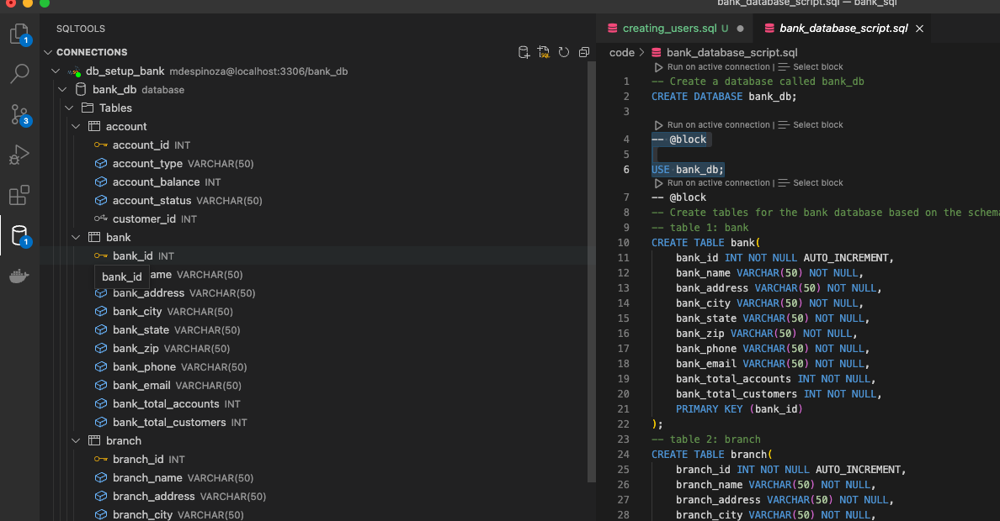
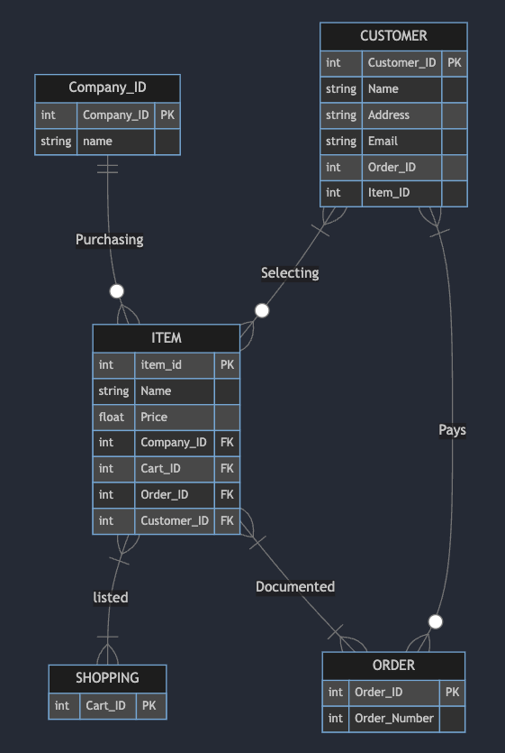

# SQL Scripts for building a DB in MYSQL

The example being used in this repository is based on defining a DB schema for banking.   Additionally, then adding a script to upload a # of tuples to each table. 

> When using MYSQL note that you may need to run this command to connect to the DB: ALTER USER 'username'@'localhost' IDENTIFIED WITH mysql_native_password BY 'password!';

 

---------

  Here is the folliwing ER diagram for the DB:

- A Company is Purchasing zero or many items 
    - Each item listed can belong to one company who is purchasing it
- An item is listed in a online/application shopping cart
    - Multiple items can be pruchased in one transaction or in various transactions meaning there can be one or more shopping carts
- One or more items can belong to one order or the items can be in various different orders
- Customer selects none or many items to purchase
    - Customer pays zero or many orders

 

Sources: 
- https://dev.mysql.com/doc/refman/8.0/en/privileges-provided.html
- https://mermaid.live/edit#pako:eNqFU8tuwjAQ_BXLZ_iB3CpC2whBLEJvkdA2XsBqbCM_Dsjk3-sQHk0I6l5izc7uzHrjQCvNkSYUTSpgb0CWisSYaXkEddpm6fk8nepAss18SRLCvKkOYIXaD3kkdEgbQrm_GbZ4pKwzsZgokNiBTfe59G-i1jmQ4jNnLFt9RL1aWIf8mZKv0_k65lNdeYmqzxk4EQ7lVvAxG6u7jTZ2tQZHmBEVkpfDvC8GKTBuDM8NRzNa4K3Tsp-7XsJ98DCuwfr07hLCC102amjl5TeaXpvZV7HJl7FT01t1gTVW7rHpAeu2AQYnO2CE1wP_u4Mr-Ma5QWuf8LkEUY8P3Eezduk3sKETGg3EWh5_9Yu9kroDRmGaxCMH81PSUrU88E4XJ1XRxBmPE-qPHBxeHwdNdlBbbH4BkUfxQA
